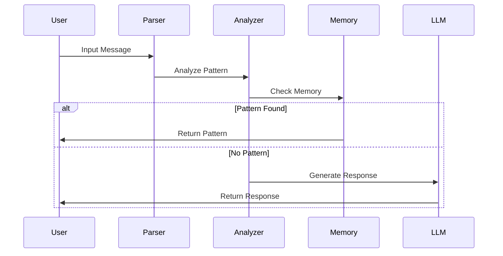

# Chat Impersonation System Documentation

## Table of Contents
1. [Architecture Overview](#architecture-overview)
2. [Prerequisites](#prerequisites)
3. [Setup & Installation](#setup--installation)
4. [Running the System](#running-the-system)
5. [Core Components](#core-components)
6. [Services](#services)
7. [Tools & Utilities](#tools--utilities)
8. [Configuration](#configuration)
9. [Testing](#testing)
10. [Data Flow](#data-flow)
11. [Usage Guide](#usage-guide)

## Architecture Overview

The system is built with a modular architecture focusing on:
- Message parsing and analysis
- Pattern recognition and learning
- Response generation
- Feedback and improvement

### Directory Structure 

## Core Components

### 1. Chat History Model
**File**: `models/chatHistory.js`
- Handles chat data structure
- Parses raw messages
- Filters messages by user
- Validates against configured users

### 2. PDF Parser
**File**: `utils/pdfParser.js`
- Extracts text from PDF chat exports
- Parses WhatsApp-style messages with timestamps
- Validates and filters messages
- Handles message format:
  ```
  [timestamp] username: message
  ```

## Services

### 1. Ollama Service
**File**: `services/ollamaService.js`
- Integrates with Ollama LLM
- Manages response generation
- Handles pattern matching
- Features:
  - Pattern-based responses
  - LLM-generated responses
  - Response scoring
  - Pattern learning

### 2. Vector Store
**File**: `services/vectorStore.js`
- Stores message embeddings
- Manages vector operations
- Handles batch processing
- Error handling and validation

### 3. Response Memory
**File**: `services/responseMemory.js`
- Stores successful response patterns
- Implements reinforcement learning
- Features:
  - Pattern scoring
  - Response ranking
  - Success tracking
  - User-specific patterns

### 4. Conversation Analyzer
**File**: `services/conversationAnalyzer.js`
- Analyzes conversation patterns
- Extracts communication styles
- Tracks:
  - Vocabulary usage
  - Response types
  - Message patterns
  - User behavior

## Tools & Utilities

### 1. Pattern Analyzer
**File**: `tools/patternAnalyzer.js`
- Sophisticated pattern analysis
- Features:
  - Semantic similarity
  - Context relevance
  - Style consistency
  - Sentiment analysis
  - Response variations

### 2. Feedback Interface
**File**: `tools/feedbackInterface.js`
- Interactive feedback collection
- Response rating system
- Pattern reinforcement
- Analysis visualization

## Configuration
**File**: `config/config.js`

## Testing

### 1. Interactive Testing
**File**: `tests/interactiveTest.js`
- Real-time chat simulation
- Direct response testing
- Pattern verification

### 2. Response Testing
**File**: `tests/testResponses.js`
- Automated response testing
- Pattern matching validation
- Success rate tracking

### 3. Visual Report Generator
**File**: `tests/visualReportGenerator.js`
- Generates analysis reports
- Visualizes patterns
- Shows statistics

## Data Flow

1. **Input Processing**
   ```
   PDF Chat -> Parser -> Chat History -> Analysis
   ```

2. **Response Generation**
   ```
   User Input -> Pattern Matching -> Memory Check -> LLM -> Response
   ```

3. **Learning Loop**
   ```
   Response -> Feedback -> Analysis -> Memory Update
   ```

## Usage Guide

### 1. Setup

### 2. Configuration
1. Update `config.js` with your settings
2. Place chat PDF in data directory

### 3. Running Tests
bash
Interactive testing
node backend/tests/interactiveTest.js
Generate analysis report
node backend/tests/visualReportGenerator.js
View report
node backend/tests/reportServer.js

## Best Practices

1. **Data Preparation**
   - Clean chat exports
   - Verify user names
   - Check message format

2. **Pattern Training**
   - Start with small datasets
   - Validate patterns regularly
   - Use feedback system

3. **Performance Optimization**
   - Monitor memory usage
   - Batch process large files
   - Cache frequent patterns

4. **Maintenance**
   - Regular pattern cleanup
   - Update user configurations
   - Monitor success rates

```bash
# Run pattern analysis
node backend/tools/patternAnalyzer.js

# Collect feedback
node backend/tools/feedbackInterface.js
```

### Data Flow Architecture


## API Documentation

### Core Services API

#### 1. Ollama Service

```typescript:docs/README.md
interface OllamaService {
    generateResponse(
        message: string,
        context: Message[],
        impersonateUser: string
    ): Promise<string>;

    rewardResponse(
        trigger: string,
        response: string,
        user: string
    ): Promise<boolean>;
}

interface Message {
    user: string;
    message: string;
    timestamp: string;
}
```

#### 2. Pattern Analyzer
```typescript
interface PatternAnalysis {
    semantic: {
        overlap: number;
        similarity: number;
    };
    context: {
        frequency: number;
        contextScore: number;
    };
    style: {
        metrics: StyleMetrics;
        consistency: number;
    };
    score: {
        total: number;
        components: ScoreComponents;
    };
}

interface StyleMetrics {
    length: number;
    wordCount: number;
    punctuation: number;
    emoji: number;
}
```

#### 3. Response Memory
```typescript
interface ResponseMemory {
    patterns: {
        [key: string]: {
            trigger: string;
            user: string;
            responses: {
                [response: string]: ResponseData;
            };
        };
    };
    successfulMatches: {
        [key: string]: {
            lastSuccess: string;
            successCount: number;
        };
    };
}

interface ResponseData {
    count: number;
    successCount: number;
    lastUsed: string;
}
```

## Deployment Guide

### 1. Prerequisites
```bash
# System requirements
Node.js >= 14.x
npm >= 6.x
RAM >= 8GB
Storage >= 20GB

# Required dependencies
npm install natural pdf-parse express axios
```

### 2. Environment Setup
```bash
# Create directory structure
mkdir -p backend/{config,models,services,tools,utils,tests,data}

# Set up environment variables
cat > .env << EOL
NODE_ENV=production
PORT=3000
OLLAMA_URL=http://localhost:11434
MODEL_NAME=mistral
DATA_DIR=./data
EOL
```

### 3. Production Deployment
```bash
# Build process
npm run build

# Start services
npm run start:prod

# Monitor processes
pm2 start ecosystem.config.js
```

## Performance Optimization

### 1. Memory Management
```javascript
// Example memory optimization
class MemoryOptimizer {
    constructor() {
        this.maxCacheSize = 1000;
        this.cache = new Map();
    }

    optimizeCache() {
        if (this.cache.size > this.maxCacheSize) {
            const entries = [...this.cache.entries()];
            entries.sort((a, b) => b[1].score - a[1].score);
            this.cache = new Map(entries.slice(0, this.maxCacheSize));
        }
    }
}
```

### 2. Response Time Optimization
```javascript
// Example response optimization
class ResponseOptimizer {
    constructor() {
        this.patterns = new Map();
        this.threshold = 0.8;
    }

    async optimizeResponse(input) {
        // Fast path: exact match
        if (this.patterns.has(input)) {
            return this.patterns.get(input);
        }

        // Medium path: pattern match
        const pattern = await this.findBestPattern(input);
        if (pattern && pattern.score > this.threshold) {
            return pattern.response;
        }

        // Slow path: LLM generation
        return this.generateLLMResponse(input);
    }
}
```

## Error Handling

### 1. Service Level
```javascript
class ServiceErrorHandler {
    static async handleError(error, context) {
        console.error(`Error in ${context}:`, error);
        
        if (error.code === 'ECONNREFUSED') {
            return {
                status: 'error',
                message: 'Service unavailable',
                retry: true
            };
        }

        return {
            status: 'error',
            message: error.message,
            retry: false
        };
    }
}
```

### 2. Pattern Level
```javascript
class PatternErrorHandler {
    static validatePattern(pattern) {
        if (!pattern.trigger || !pattern.response) {
            throw new Error('Invalid pattern structure');
        }

        if (pattern.score < 0 || pattern.score > 1) {
            throw new Error('Invalid pattern score');
        }

        return true;
    }
}
```

## Monitoring and Logging

### 1. Performance Monitoring
```javascript
class PerformanceMonitor {
    static metrics = {
        responseTime: [],
        patternHits: 0,
        llmCalls: 0,
        errors: 0
    };

    static logMetric(type, value) {
        switch(type) {
            case 'responseTime':
                this.metrics.responseTime.push(value);
                break;
            case 'patternHit':
                this.metrics.patternHits++;
                break;
            // ... other metrics
        }
    }
}
```

Would you like me to:
1. Add more implementation details?
2. Include testing strategies?
3. Add security considerations?
4. Create scaling guidelines?

## Prerequisites

1. **Node.js & npm**
   - Node.js >= 14.x
   - npm >= 6.x

2. **Python & pip** (for Chroma)
   - Python >= 3.8
   - pip >= 20.0

3. **ChromaDB**
   ```bash
   pip install chromadb
   npm install chromadb
   ```

## Setup & Installation

1. **Install Dependencies**
   ```bash
   npm install
   ```

2. **Configure Environment**
   ```bash
   cp .env.example .env
   # Edit .env with your settings
   ```

## Running the System

1. **Start ChromaDB**
   ```bash
   # Start the Chroma backend
   chroma run
   
   # Verify Chroma is running
   node backend/scripts/startChroma.js
   ```

2. **Start the Application**
   ```bash
   npm start
   ```

3. **Run Tests**
   ```bash
   npm test
   ```

### Troubleshooting Chroma

If you encounter issues with Chroma:

1. **Check Connection**
   ```bash
   node backend/scripts/startChroma.js
   ```

2. **Common Issues**
   - Port 8000 already in use
   - Chroma backend not running
   - Python environment issues

3. **Solutions**
   ```bash
   # Restart Chroma
   pkill -f chroma
   chroma run

   # Use different port
   chroma run --port 8001
   
   # Clear Chroma data
   rm -rf ~/.cache/chroma
   ```
